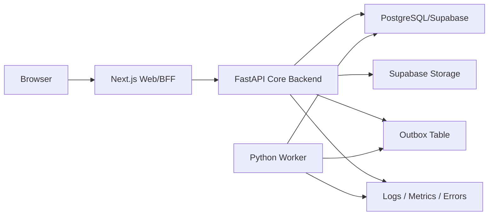

# Deployment Topology

## Components

- Web: Next.js frontend and BFF/proxy routes.
- API: FastAPI core backend.
- Worker: Python outbox/process/background worker.
- DB: Supabase/PostgreSQL.
- Auth/Storage: Supabase Auth and Storage.
- Observability: structured logs, metrics and error tracking.
- Optional future cache/queue: Redis or managed queue.

## Traffic Flow

Browser to FastAPI direct access is a future option only after CORS/JWT strategy is explicitly approved.

## Platform Options

- Vercel for Next.js plus external FastAPI/worker containers.
- Docker Compose on VPS for all services except managed Supabase.
- Kubernetes later for multi-tenant scale.
- GitHub Actions can trigger deploy hooks for each runtime independently.
