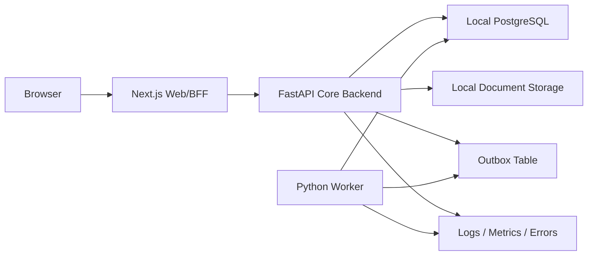

# Deployment Topology

<!-- source-of-truth-standard: contract overrides markdown -->

> Visibility note, 2026-06-07: deployment topology does not grant product,
> module, or feature access. The older environment-based development/release
> visibility model is deprecated. Tenant license / plan entitlement is the
> canonical user-facing visibility model after the release registry gate.

## Components

- Web: Next.js frontend and BFF/proxy routes.
- API: FastAPI core backend.
- Worker: Python outbox/process/background worker.
- DB: local PostgreSQL on the remote server or approved server-local database target.
- Auth: Next app session plus FastAPI trusted proxy context.
- Storage: local filesystem document storage behind controlled media routes.
- Observability: structured logs, metrics and error tracking.
- Optional future cache/queue: Redis or managed queue.

## Traffic Flow

Browser to FastAPI direct access is a future option only after CORS/JWT strategy is explicitly approved.

## Backend Ownership Rule

FastAPI is the deployment unit for core ERP backend behavior. Next.js API
routes deployed with the web app are compatibility BFF endpoints only. They may
forward auth/session context, handle upload/session/bootstrap concerns, and keep
documented temporary fallbacks during migration. They must not become the
permanent home for operation orchestration, process, audit, outbox, policy,
readiness, integrity or projection runtime logic.

Release checks should include:

- `npm run migration:status`
- `npm run boundaries:check`
- `npm run ts-backend:inventory` when architecture inventory needs refresh

## Platform Options

- Vercel for Next.js plus external FastAPI/worker containers.
- Docker Compose on VPS for web/API/worker/database when adopted.
- Kubernetes later for multi-tenant scale.
- GitHub Actions can trigger deploy hooks for each runtime independently.

These platform choices are operational deployment choices only. They must not be
used as module visibility controls for tenants or users.
