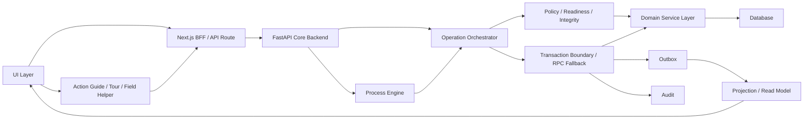

# Eden ERP Platform Architecture

Eden ERP, Next.js frontend/BFF ve FastAPI/Python core backend ayrimina ilerleyen moduler ERP platformudur. Supabase/PostgreSQL veri, auth ve storage platformu olarak kalabilir; kalici business logic Next.js API route'larinda tutulmaz.

## Ana Referans

Bu dokuman platform mimarisinin ana referansidir. Detay sozlesmeler asagidaki dokumanlarda tutulur:

- [Module Registry](./ModuleRegistry.md)
- [Permission / Policy Engine](./PermissionPolicyEngine.md)
- [Field Control Registry](./FieldControlRegistry.md)
- [Process Engine](./ProcessEngine.md)
- [Event Contracts](./EventContracts.md)
- [Outbox Dispatcher](./OutboxDispatcher.md)
- [Audit Log and Compliance Trace](./AuditLogAndComplianceTrace.md)
- [Transaction Boundary](./TransactionBoundary.md)
- [Action Guide Registry](./ActionGuideRegistry.md)
- [Guided Tour and Help](./GuidedTourAndHelp.md)
- [Module Readiness and Setup](./ModuleReadinessAndSetup.md)
- [Runtime Feature Visibility](./RuntimeFeatureVisibility.md)
- [Modular Navigation](./ModularNavigation.md)
- [Action Center and Pending Work](./ActionCenterAndPendingWork.md)
- [Data Integrity Guards](./DataIntegrityGuards.md)
- [Cross Domain Consistency](./CrossDomainConsistency.md)
- [Domain Boundaries](./DomainBoundaries.md)
- [Domain Service Layer](./DomainServiceLayer.md)
- [Codebase Inventory](./CodebaseInventory.md)
- [Legacy / Obsolete Code Audit](./LegacyObsoleteCodeAudit.md)
- [Python Backend Migration](./PythonBackendMigration.md)
- [Next API Route Migration Inventory](./NextApiRouteMigrationInventory.md)
- [Next Proxy Coverage Matrix](./NextProxyCoverageMatrix.md)
- [FastAPI Endpoint Coverage Matrix](./FastAPIEndpointCoverageMatrix.md)
- [Remaining TS Backend Inventory](./RemainingTsBackendInventory.md)
- [TS Backend Removal Report](./TsBackendRemovalReport.md)
- [Productization Readiness Report](./ProductizationReadinessReport.md)
- [Python Migration Map](./PythonMigrationMap.md)
- [Python Migration Roadmap](./PythonMigrationRoadmap.md)
- [Branch FastAPI Migration](./BranchFastAPIMigration.md)
- [Company Official Changes FastAPI Migration](./CompanyOfficialChangesFastAPIMigration.md)
- [Capital / Ownership FastAPI Migration](./CapitalOwnershipFastAPIMigration.md)
- [Representative Authority FastAPI Migration](./RepresentativeAuthorityFastAPIMigration.md)
- [Ownership Transactions FastAPI Migration](./OwnershipTransactionsFastAPIMigration.md)
- [Process / Outbox / Audit FastAPI Migration](./ProcessOutboxAuditFastAPIMigration.md)
- [OpenAPI Contract Strategy](./OpenAPIContractStrategy.md)
- [Scaling Architecture](./ScalingArchitecture.md)
- [Next Cleanup Plan](./NextCleanupPlan.md)
- [Technical Debt and Migration Plan](./TechnicalDebtAndMigrationPlan.md)
- [Platform Migration Final Report](./PlatformMigrationFinalReport.md)
- [MVP Release Readiness Report](../release/MVPReleaseReadinessReport.md)

## Platform Akisi

## Sorumluluk Ayrimi

- Module Registry: Modulun sistemde ne getirdigini tanimlar. Entity, route, menu, permission, action, projection ve event sozlesmesi statiktir.
- Feature Resolver: Modulun bu tenant/user icin aktif olup olmadigini belirler. Lisans, kurulum ve dependency durumlari burada cozulur.
- Module Readiness: Modul acik olsa bile gerekli kayit alanlari, read model gorunumleri, ayarlar ve bagli moduller hazir mi kontrol eder.
- Setup Wizard: Calisma alanindaki eksik kurulum adimlarini teknik terim kullanmadan gosterir ve dogru aksiyona yonlendirir.
- Permission Registry: Hangi permission anahtarlarinin var oldugunu ve fallback iliskilerini tanimlar.
- Permission Guard: `requirePermission` ile mevcut basit kontrolu, `requireAnyPermission` ile fallback destekli kontrolu saglar.
- Policy Engine: Permission, scope, modul durumu, kayit durumu ve is kuralini tek karar modelinde birlestirir.
- Scope Policy: Company, branch, organization unit ve facility erisim/yazma kapsamlarini merkezi kontrol eder.
- Process Engine: Islemin adimlarini, gorevlerini, onaylarini ve durum gecislerini yoneten katmandir.
- Operation Orchestrator: Kritik veri degisikligini tek is mantigi noktasi olarak guvenli yapar.
- Transaction Boundary: Kritik mutation zincirini RPC ile atomic yapmaya hazirlar; RPC yoksa standart application fallback ve compensation davranisini uygular.
- Event Contract Registry: Event tiplerinin version, modul, aggregate, projection, audit, notification ve AI context etkisini tanimlar.
- OutboxEventService: Operation ve process sonuclarini standart outbox event kaydi olarak uretir.
- Outbox Dispatcher: Pending eventleri lock/retry/idempotency kurallariyla isler ve handler katmanina aktarir.
- Event Handler: Projection invalidation, notification, audit ve AI context refresh gibi yan etkileri uygular.
- Audit Log: Kim, ne zaman, nerede, hangi yetki/surec/islem kapsaminda hareket etti teknik-denetim izini tutar.
- Projection Registry: Liste, detay ve ozet ekranlari icin read model sozlesmesini saglar.
- Field Control Registry: Alanlarin normal form edit, taslak edit, resmi operation, sistem/projection veya iliski endpointi ile mi degisecegini tanimlar.
- Action Guide Registry: Kullanici niyetini dogru modul/action/route/wizard yoluna baglar; yeni islem uydurmaz.
- Domain Boundary Registry: Entity, tablo ve operation sahipligini bounded context bazinda tanimlar; cross-domain yazma kurallarinin sonraki domain service refactor'unda tek sozlesmeden okunmasini saglar.
- Platform Consistency Check: Registry referanslari, module/action/permission/projection/event eslesmeleri ve platform modul sozlesmelerini dev/test ortaminda kontrol eder.
- FastAPI Core Backend: Domain service, operation orchestration, process engine, policy, integrity, audit, outbox ve transaction boundary icin hedef kalici backend katmanidir.
- Next.js BFF: Gecis surecinde proxy/adaptor ve UI-specific endpoint olarak kalir; kalici business logic burada tutulmaz.

## Mevcut Akis

Frontend dogrudan Supabase cagirmadan Next.js BFF veya FastAPI client katmanina gider. Gecis surecinde Next.js API route'lari request/response adaptorudur; kalici hedef FastAPI core backend'dir. Kritik resmi islemler operation/wizard akisi, FastAPI operation services ve transaction boundary ile calisir.

## Core Principles

- Kullaniciya teknik platform dili degil, is odakli yol gosterilir.
- `+ Ekle` standart sayfalarda taslak kayit olusturur; resmi sonuc doguran degisiklikler wizard/operation ile tamamlanir.
- Frontend dogrudan Supabase veya RPC cagirmadan API/adaptor katmanini kullanir.
- Permission/Policy kullanici yetkisini; Readiness modul hazirligini; Integrity veri tutarliligini; Visibility UI gorunurlugunu belirler.
- Process Engine surec adimlarini yonetir; Operation Orchestrator mutation akisini koordine eder; Domain Service domain veri islemini uygular.
- Outbox external side effect yapmaz; event kaydeder. Audit history/transaction yerine gecmez; denetim izini tamamlar.
- Obsolete davranis "backward compatibility" gerekcesiyle korunmaz. Eski davranis sadece canli gecis koprusu olarak `proxy_to_fastapi_with_legacy_fallback` veya `deprecated_wrapper` status'u ile planli sureyle kalabilir.

## Registry Iliskisi

Module Registry, Projection Registry ve Action Guide arasinda ortak sozlesme kaynagi olacak sekilde tasarlanmistir.

- Module contract action key'leri Action Guide adaylarini filtreler.
- Module contract projection key'leri read model sozlesmesiyle eslenir.
- Module contract route/menu bilgileri ileride Sidebar ve navigation uretiminde kullanilir.
- Module contract event bilgisi ileride Outbox Dispatcher ve projection refresh surecleriyle baglanabilir.
- `lib/platform/platformConsistencyCheck.ts` Action Guide, Field Control, Module Registry, Event Contract Registry, Process Registry, Integrity Registry, Navigation Registry, Feature Flags ve Readiness Registry referanslarini tek raporda toplar. Critical sorun build'e zorunlu bagli degildir ancak release oncesi kontrol noktasi olarak calistirilabilir.

## Domain Boundaries

Domain Boundaries, Eden ERP'de sirket, ortaklik, temsil yetkisi, sube, organizasyon, tesis/lokasyon, muhasebe, IK, proje, dokuman, surec, audit, setup ve AI rehber kavramlarinin birbirine karismadan buyumesini saglar.

Ana kural: Eden ERP'de entity sahipligi domain bazinda belirlenir. Baska domain'in sahip oldugu veri dogrudan guncellenmez; domain service, operation orchestrator veya event/projection yoluyla etkilesim kurulur.

`lib/domains/domainOwnershipRegistry.ts` entity, tablo ve operation ownership bilgisini tutar. `lib/domains/domainBoundaryGuard.ts` cross-domain yazma denemeleri icin allowed path kararini hazirlar. Bu helperlar henuz buyuk refactor yapmadan sonraki Domain Service Layer fazi icin sozlesme noktasi olusturur.

Domain Service Layer, bu boundary sozlesmesini kod seviyesinde uygulamaya baslar. Route request/response adaptoru olarak kalir; Operation Orchestrator akisi yonetir; Domain Service ise domain'e ait query, mutation ve is kurali davranisini standart `DomainServiceResult` ile dondurur. Branch, Organization, Facility, Representative Authority, Ownership ve Company domain servisleri ilk gercek fonksiyonlarla hazirlanmistir.

Sube Acilisi fallback akisi artik Organization Domain Service ile organization unit, Facility Domain Service ile facility ve Branch Domain Service ile branch kaydi olusturur. Sube Kapanisi fallback akisi organization/facility aksiyonlarini ilgili domain service uzerinden uygular ve branch close mutation'ini Branch Domain Service'e verir.

Bu TypeScript domain service katmani kalici hedef degildir; Python migration icin sozlesme ve davranis hazirligi olarak kabul edilir. Nihai uygulama `backend/app/domains/**` altindaki FastAPI/Python servislerine tasinacaktir.

Kritik kavram ayrimlari:

- Sirket tuzel kisiliktir; sube bagli alt resmi/operasyonel birimdir.
- Sube resmi kayittir; tesis/lokasyon fiziksel yerdir.
- Sube organizasyon birimi degildir; organization unit hiyerarsi ve kadro yapisidir.
- Ortak pay, oy, kar ve sermaye hakkidir; temsilci sirket adina islem yapma yetkisidir.
- Ortak karti kisi/kurum + sirket iliskisidir; pay/oy/kar/sermaye haklari ownership transaction ile dogar ve normal kart PATCH ile degismez.
- Temsilci karti kisi/kurum + sirket roludur; temsil yetkisi scope, limit ve yetki turu ile ayri transaction'dir.
- Sermaye artirimi hukuki/ortaklik islemidir; muhasebe tahsilati odeme ve mutabakat katmanidir.
- Wizard veri toplar, Process adim/gorev/onay yonetir, Operation Orchestrator mutation yapar.
- History kullaniciya is gecmisi gosterir; Audit teknik-denetim izidir.

## Runtime Karar

Runtime modul durumu `ModuleFeatureResolver` tarafindan belirlenir:

- `available`: Modul kullanilabilir.
- `disabled`: Modul bu calisma alaninda aktif degil.
- `unlicensed`: Modul icin lisans aktif degil.
- `setup_required`: Modul acik ancak kurulum tamamlanmamis.
- `dependency_missing`: Zorunlu bagimli modul eksik.

Bu durum API guard, session bootstrap, Sidebar ve Action Guide tarafinda ayni is diliyle kullanilir.

## Module Readiness ve Kurulum

Module Runtime Status modulun aktif/lisansli olup olmadigini soyler; Module Readiness ise modulun calisma alaninda gercekten kullanima hazir olup olmadigini kontrol eder. Bir modul acik olabilir ancak gerekli kayit alanlari, read model gorunumleri, ayarlari veya bagli modulleri eksikse kullanici teknik hata gormez; "kurulum gerekli" mesaji ve dogru kurulum aksiyonu gosterilir.

`lib/setup/moduleReadinessRegistry.ts` her modul icin required/optional kayit alanlarini, gorunumleri, islem altyapisini, ayarlari ve dependency'leri tanimlar. `TenantReadinessService` bu contract'lari calisma alani bazinda degerlendirir. Session bootstrap `setup` ozeti dondurur; Module Guard, Action Guide ve setup ekrani ayni readiness sonucunu kullanir.

Missing infrastructure hatalari `infrastructureErrorMapper` ile is diliyle kurulum durumuna cevrilir. Kullaniciya "table missing", "migration", "RPC" veya "tenant" gibi teknik terimler gosterilmez; "calisma alani", "kurulum gerekli" ve "gerekli modul aktif degil" dili kullanilir.

## Permission ve Policy

Permission katmani iki seviyeli calisir. `requirePermission` mevcut basit izin kontrolunu korur. `requireAnyPermission`, Permission Registry fallbacklerini degerlendirerek `branches.opening.start` yoksa `companies.edit` gibi uyumlu izinlerle gecis saglayabilir.

Policy Engine sadece permission'a bakmaz. Access Context uzerinden tenant, company, branch, organization unit, facility, module, action ve record status bilgisini birlikte degerlendirir. Bu sayede Process Engine ileride "bu adimi kim yapabilir?" sorusunu ayni karar modeliyle cevaplayabilir.

## Field Control

Field Control Registry, kart formu ile resmi islem/wizard ayrimini alan seviyesinde standartlastirir. Aktif veya lifecycle'a girmis kayitlarda `company.trade_name`, `company.address`, `company_partner.share_ratio`, `company_representative.authority_types` ve `company_branch.opening_registration_date` gibi alanlar normal PATCH ile degil ilgili operasyonla degisir.

Backend PATCH guard'lari ve frontend EntityForm lock aciklamalari ayni registry'den beslenmeye baslar. EntityForm kilitli alanlari sessizce kapatmaz; bilgi ikonu ile nedeni, dogru wizard/operation yolunu, yetki/modul/kayit durumu engelini ve opsiyonel modul uyarilarini gosterir. `suggestOperationForField` fonksiyonu Action Guide'in ileride "bu alan hangi islemle degisir?" sorusunu cevaplamasi icin alan -> operasyon eslemesini saglar.

Modul bagimli operasyonlar backend'de de enforce edilir. Ornegin Sermaye Artirimi, Ortaklarimiz modulu ve `currentOwnership` dagilimi olmadan baslatilamaz; precheck bu durumda `MODULE_DEPENDENCY_MISSING` ile is diliyle hata dondurur.

## Process Engine MVP

Process Engine MVP, `ProcessDefinition`, `ProcessInstance`, `ProcessTask`, `ProcessApproval` ve `ProcessEvent` kavramlarini platforma ekler. Wizard kullanicidan veriyi toplar; Process Engine adimi ve gorevi yonetir; Operation Orchestrator gercek veri degisikligini yapar.

Pilot surecler `company_branch_opening_process` ve `company_branch_closing_process` olarak tanimlandi. Bu surecler mevcut Sube Acilisi/Kapanisi wizard'larini bozmaz; istenirse process instance olusturup form, inceleme, onay ve operation adimlarini takip edebilir.

Pending Actions altyapisi `process_tasks` kayitlarini okuyabilecek hale gelir. Boylece surec gorevleri mevcut bildirim alanina asamali olarak eklenebilir.

## Action Center ve Bekleyen Isler

Action Center, process task, approval, operation request, outbox ve projection uyarilarini tek kullanici is listesine cevirir. Kullanici teknik kaynak adlari yerine "Tamamlanacak gorev var", "Onay bekleyen islem var", "Tamamlanamayan islem var" ve "Sistem guncellemesi bekliyor" gibi is diliyle mesajlar gorur.

`/api/action-center` unified listeyi, `/api/action-center/summary` dashboard ve header ozetini, `/api/action-center/by-record` ise sirket/sube detayindaki kayit bazli bekleyen isleri dondurur. Eski `/api/notifications/pending-actions` endpoint'i geriye uyumlu adaptor olarak kalir.

Action Center tenant ve company scope'a uyar. Outbox/projection gibi sistem uyarilari sadece ilgili sistem veya ayar yetkisi olan kullanicilara gosterilir. Missing process/outbox/projection altyapisi kullanici akisini bozmaz; kaynak bos veya uyarili kabul edilir.

## Event ve Outbox

Event Contract Registry `lib/events` altinda event sozlesmelerini merkezi hale getirir. `company.branch_opened`, `company.branch_closed`, `ownership.transaction_completed`, `representative.authority_updated` ve `process.task_created` gibi eventler projection, notification, audit ve AI context etkilerini contract uzerinden tasir.

OutboxEventService eski enqueue imzasini korur; eksik `event_version`, `module_key`, `aggregate_type` gibi alanlari registry'den tamamlar. Dispatcher `outbox_events` kayitlarini `pending -> processing -> completed/failed/skipped` akisi ile isler. Handlerlar idempotent calisir ve `outbox_event_handler_runs` tablosu tekrar calistirma guvenligi icin hazirdir.

Cron endpoint `CRON_SECRET` olmadan calismaz. Projection/cache altyapisi eksikse invalidation handler no-op doner; event dispatch kullanici akisini kirmaz.

## Audit Log ve Compliance Trace

Audit Log mevcut history, transaction ve lifecycle event tablolarinin yerine gecmez. History kullaniciya gosterilen is gecmisidir; transaction resmi/operasyonel islem kaydidir; lifecycle event kayit durum gecisidir; outbox event sistem ici olay yayini icindir. Audit Log ise kullanici, zaman, kapsam, yetki, islem, surec ve sonuc izini teknik-denetim katmani olarak tutar.

Audit altyapisi `audit_logs` tablosunu tenant scope ile genisletir. Eski `instance_id/module_code/resource/action` alanlari kalici uyumluluk hedefi degildir; canli veri tasinana kadar acik deprecation planiyla okunabilir kalir. Yeni `tenant_id`, `module_key`, `entity_type`, `action_type`, `operation_id`, `process_instance_id`, `old_values`, `new_values`, `changed_fields`, `result_status` ve `severity` alanlari standart denetim sozlesmesini saglar.

Hassas veriler audit'e raw yazilmaz. Sifre, token, secret, credential ve signed URL tamamen maskelenir; IBAN, hesap no, kimlik/vergi/pasaport numarasi, telefon ve e-posta kismi maskelenir. Audit insert cogu akista best effort calisir; yazim hatasi kullanici islemini kirmadan sistem loguna duser.

Operation Orchestrator operation start/complete/fail, Process Engine process eventleri, Permission/Policy gercek API redleri ve Outbox failed/skipped durumlari audit'e baglanir. UI eligibility kontrolleri audit sisme riski nedeniyle log uretmez.

## Transaction Boundary ve RPC Hazirligi

Transaction Boundary, Operation Orchestrator'in altinda calisir. Permission, policy, tenant scope, idempotency ve precheck kontrolleri orchestrator tarafinda yapildiktan sonra mutation zinciri boundary'ye verilir.

Boundary once RPC sozlesmesini kullanmaya hazirdir. RPC yoksa veya `RPC_NOT_IMPLEMENTED` donerse fallback izinliyse mevcut application mutation akisi calisir. `requireRpc` acik olan gelecekteki kritik islemlerde RPC olmadan islem baslatilmaz.

Sube Acilisi ve Sube Kapanisi ilk pilot entegrasyonlardir. Her iki akista da RPC payload contract'i, fallback davranisi, outbox siralamasi, audit start/complete/fail izleri ve partial failure compensation stratejisi tanimlanir. Sermaye Artirimi, Temsilci Yetkisi ve Ortaklik Islemleri icin RPC contract'lari hazirdir.

## Temsil Yetkisi Kapsami

Temsilci karti kisi/kurum + sirket temsilci rolunu tutar; yetki kapsami karti cogaltmadan authority transaction ve current authority read modelinde tutulur. Ayni temsilci sirket geneli, sube, organizasyon birimi ve tesis/lokasyon bazinda farkli yetkilere sahip olabilir.

Scope alanlari `scope_type`, `branch_id`, `organization_unit_id`, `facility_id`, `scope_label` ve `scope_notes` olarak temsil yetkisi isleminde saklanir. Normal temsilci PATCH bu alanlari reddeder; degisiklik Temsilcilik Baslatma veya Yetki Kapsami Degisikligi islemleriyle yapilir.

Policy katmani secilen scope'un ayni sirkete ait ve aktif olmasini zorunlu tutar. Kapali/pasif sube, organizasyon birimi veya tesis/lokasyon icin yeni aktif yetki verilemez. Temsilcilerimiz listesi ve Subelerimiz detayindaki read-only temsilci ozeti bu scope read modelinden beslenir.

## AI Islem Rehberi

Action Guide Registry, kullanicinin "Ne yapmak istiyorsunuz?" sorusuna verdigi dogal dil cevabini tanimli action sozlesmelerine esler. MVP deterministik matcher kullanir; Module Registry ve Action Guide Registry disinda action uretmez.

Rehber veri degistirmez. Sadece dogru sayfa, kayit ve wizard yolunu onerir. Veri degistiren her adim yine ilgili wizard icinde kullanici onayiyla tamamlanir.

Eligibility sonucu modul, permission, kayit statusu, optional modul uyarilari ve Policy Engine kararini kullanir. Field Control Registry ile "bu alan neden kapali?" sorulari ilgili resmi isleme baglanabilir.

## Guided Tour ve Yardim

Guided Tour ve Contextual Help, kullaniciya teknik mimariyi anlatmak yerine bulundugu ekranda dogru islem yolunu gosterir. Kullanici bir islemi yapamiyorsa sistem bunu sessizce engellemez; nedenini aciklar ve dogru sayfa, kayit veya sihirbaza yonlendirir.

`+ Ekle` standart sayfalarda taslak kayit olusturur. Resmi sonuc doguran unvan degisikligi, sermaye artirimi, sube acilisi, ortaklik girisi ve temsil yetkisi gibi islemler ilgili sihirbazlarla tamamlanir.

Genel tur ve sayfa mini turlari kullanici calisma alani tercihleri icinde saklanir. Cookie'ye guvenilmez; backend user state tamamlanan turu, kapatilan sayfa turlarini ve kapatilan operasyon ipuclarini tutar.

EntityForm kilitli alanlari sessizce kapatmaz. Yardim ikonu alani neden degistiremedigini, hangi islemle degisecegini, varsa yetki/modul/kayit durumu engelini ve AI Islem Rehberi baglantisini gosterir.

## Modular Navigation ve Runtime Visibility

Navigation Registry, menu itemlarini modul, route, permission ve feature flag bilgisiyle tanimlar. Mevcut Sidebar bu registry'yi hardcoded menuye uyum katmani olarak kullanir; boylece route davranisi bozulmadan merkezi navigasyona gecilir.

Runtime Visibility Resolver modul aktifligi, lisans, kurulum, bagimlilik, feature flag, permission ve kayit durumu kararlarini tek `VisibilityDecision` altinda toplar. Sidebar, operation button'lari, field helper'lari ve AI Islem Rehberi ayni disabled reason ve yonlendirme mantigini kullanmaya baslar.

Modul kapali, lisanssiz veya kurulumu eksik oldugunda kullanici teknik hata gormez. Menu veya aksiyon disabled kalir; gerekli durumda kurulum ekranina veya modul lisanslari sayfasina yonlendirilir.

## Data Integrity Guard

Data Integrity Guard, kritik operasyonlardan once verinin guvenli ve tutarli olup olmadigini kontrol eder. Policy kullanici/yetki kararini, Readiness modul/altyapi hazirligini, Integrity ise veri etkisini ve cross-domain tutarliligi degerlendirir.

Ilk uygulamada Sube Acilisi ve Sube Kapanisi orchestratorlari mutation oncesinde integrity check calistirir. Blocking sonuc varsa islem baslatilmaz; warning sonuc varsa islem devam edebilir ve uyarilar operation sonucuna, audit metadata'ya ve outbox payload'ina eklenir.

Integrity check sonucunda kullaniciya teknik tablo/view hatasi gosterilmez. "Bu sube icin aktif temsilci yetkileri var", "Ayni adla aktif sube bulunuyor" veya "Guncel ortaklik dagilimi gerekli" gibi yapilacak is odakli mesajlar doner. Action Guide ve Action Center bu summary formatini kullanabilecek sekilde hazirlanmistir.

## Page Architecture Standards

Liste sayfalari server pagination/search/sort contract'ini bozmadan calisir. Detay formlari serbest kart alanlari ile operation-controlled resmi alanlari ayirir. Sirket, ortak, temsilci ve sube sayfalarinda taslak kart olusturma ile resmi/lifecycle islem baslatma ayrimi korunur.

Sayfa icindeki action button'lari local kosullari azaltarak Runtime Visibility, Action Eligibility, Field Control ve Policy sonucuna yaklasmalidir. Modul kapali, lisanssiz veya kurulumu eksikse sayfa teknik hata yerine ModuleUnavailable/SetupRequired state'i gosterir.

## API Response Standards

Basarili API cevaplari `data`, opsiyonel `meta`, `projection`, `operation_id`, `operation_status`, `process_instance_id`, `warnings` ve `message` alanlariyla doner. Hata cevaplari `error`, `code`, opsiyonel `details`, `operation_id`, `operation_status`, `process_instance_id` ve `message` alanlarini kullanir.

Domain Service `DomainServiceResult`, Orchestrator `OperationOrchestratorResult`, Policy `PolicyDecision`, Integrity `IntegritySummary` ve Action Guide `ActionGuideResponse` formatlari kendi katmanlarinda kalir; route dosyalari bunlari NextResponse'a cevirir. Ana `error/message` is diliyle, teknik detaylar `details` altinda kalir.

FastAPI OpenAPI contract'i backend API source of truth olacaktir. TypeScript DTO ve API client'lar OpenAPI'den uretilmeli veya generated client'a delege etmelidir. Next.js API route'lari FastAPI endpointleri hazir oldukca proxy/adaptor rolune indirilecektir.

## Policy / Integrity / Readiness FastAPI Layer

Permission registry, scope policy, module readiness, operation integrity ve action
eligibility kararlarinin Python canonical MVP'si eklendi. Bu katman frontend
visibility yerine backend-side enforce edilen guard kaynagi olarak kullanilir.
Detaylar: [Policy / Integrity / Readiness FastAPI Migration](./PolicyIntegrityReadinessFastAPIMigration.md).

## Known Technical Debt

Kalan isler [Technical Debt and Migration Plan](./TechnicalDebtAndMigrationPlan.md) icinde P1/P2/P3 oncelikleriyle izlenir. Final durum, etkiler ve regresyon sonucu [Platform Migration Final Report](./PlatformMigrationFinalReport.md) dokumaninda ozetlenir.

## Sonraki Fazlar

Outbox Dispatcher ileride notification UI, server cache invalidation, audit gorunumleri ve AI context refresh kuyruklariyla derinlestirilecek. Action Guide ileride LLM destekli aciklama uretebilir; ancak secim yine registry actionlariyla sinirli kalir. Registry, resolver, policy, field-control, process ve event yapilari statik contract'lari, runtime module bilgisini ve mevcut lisans altyapisiyla uyumlulugu saglar.
