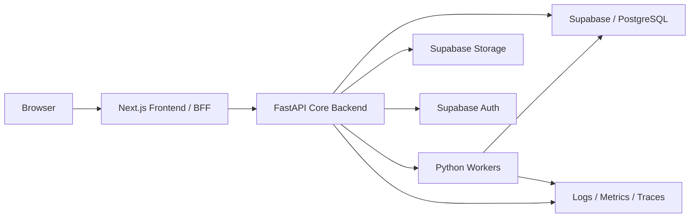

# Scaling Architecture

<!-- source-of-truth-standard: contract overrides markdown -->

Bu dokuman Eden ERP'nin ciddi olcek hedefi icin hedef runtime mimarisini tanimlar.

## Target Runtime

- Next.js frontend/BFF olarak kalir.
- FastAPI stateless core backend olarak yatay olceklenir.
- PostgreSQL/Supabase veri katmanidir.
- Background workers outbox, process, projection, audit ve notification islerini yurutur.
- Read-heavy listeler projection/read model ile servis edilir.
- Critical operations SQLAlchemy transaction, DB transaction/RPC veya stored procedure ile atomic yapilir.
- Capital increase and ownership updates run through one FastAPI transaction boundary so company capital, partner distribution, ownership transactions, lifecycle, audit and outbox stay consistent.
- Multi-tenant isolation `tenant_id`, RLS ve app policy ile korunur.
- FastAPI validates Supabase JWTs and resolves tenant/user/company scope server-side; Next BFF proxy headers are hints, not the production security boundary.
- Feature/module readiness startup ve request guardlarda kontrol edilir.
- Observability/logging/metrics zorunlu platform katmani olmalidir.
- Request/correlation ID, structured JSON logs, metrics snapshots, slow query warnings and worker logs are standard FastAPI runtime signals.
- FastAPI owns PostgreSQL connection pooling; Next.js API routes should not create a second permanent DB access layer.
- Performance budgets, load-test scenarios and DB index plans are maintained as first-class architecture contracts.
- Deployment is split into web, API and worker runtimes; see [Deployment Topology](./DeploymentTopology.md).

## Scale Target

- yuzlerce firma
- eszamanli binlerce kullanici
- yogun liste/read model trafigi
- arka planda process/outbox/audit/notification isleri

## Logical Deployment

## Data Access

FastAPI owns core data access. Next.js should not hold permanent domain query/mutation logic. Projection/read model endpoints should favor indexed views or materialized read tables for high-volume screens.

## Database Pooling

FastAPI runs as a persistent backend process, so SQLAlchemy async engine pooling is configured with:

- `DB_POOL_SIZE`
- `DB_MAX_OVERFLOW`
- `DB_POOL_TIMEOUT`
- `DB_POOL_RECYCLE`
- `DB_STATEMENT_TIMEOUT_MS`
- `USE_SUPABASE_POOLER`

Supabase/PgBouncer pooler usage is recommended for production. API processes and worker processes consume separate connection pools, so worker count must be sized together with API replicas. Serverless Next.js routes should continue to act as BFF/proxy and must not become a parallel persistent database client layer.

Internal deep health exposes the configured pool summary. Query timing and slow-query warnings use `DB_SLOW_QUERY_MS`.

## Background Work

Workers process:

- outbox dispatch
- process task timers
- projection refresh
- audit aggregation
- notification delivery
- AI context refresh

External side effects must happen outside critical DB transactions.

## Transaction Strategy

Critical operations use one of:

1. SQLAlchemy async transaction with domain services.
2. PostgreSQL RPC/stored procedure for highly atomic DB-side logic.
3. Hybrid: Python orchestration + DB transaction boundary.

Partial failure should mark operation state and audit trail; aggressive data deletion is not default compensation.

## Tenant Isolation

Tenant isolation combines:

- `tenant_id` on core tables
- RLS where enabled
- FastAPI request context
- policy/scope checks
- audit of denied attempts

No endpoint should reveal cross-tenant existence through detailed errors.

## Observability

Required follow-up:

- structured JSON logs
- request id and correlation id
- operation id / process id tracing
- outbox retry metrics
- projection lag metrics
- audit write failure alerts

Step 16 implements the first observability foundation: request/correlation middleware, structured logging context, in-memory metrics, slow query hooks, system metrics/deep health endpoints and Next BFF correlation propagation. Central log/metric storage remains a deployment follow-up.
